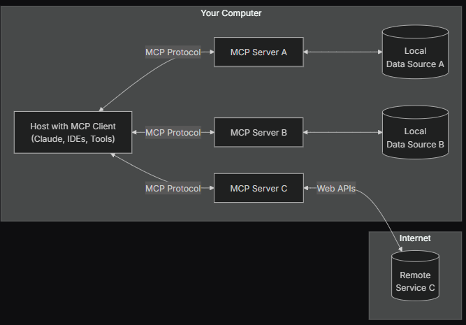

Model Context Protocol (MCP) — Kısaca Nedir?
============================================

### 1 . Tanım

**Model Context Protocol (MCP)**, özellikle büyük dil modelleri (Large Language Models, LLM’ler) kullanan uygulamalarda **veriye erişim (Resource)** ve **eylem tetikleme (Tool)** işlemlerini tek ve açık bir arayüz altında birleştiren protokoldür.Amaç, farklı **kaynaklara** (dosya, URL, veritabanı satırı, API yanıtı…) ve **işlevlere** (kod formatlayıcı, çeviri servisi, “PR oluştur” komutu…) LLM’nin tek biçim üzerinden erişmesini sağlayarak entegrasyon maliyetini düşürmektir.

### 2 . Neden Ortaya Çıktı?

Problem MCP’nin Çözümü Her entegrasyon için özel “LLM wrapper” yazma ihtiyacı **Resource** ve **Tool** şemalarının protokol seviyesinde tanımlanması LLM çağrısında veri taşıma / oturum başlatma farklılıkları initialize → read\_resource → call\_tool akışının standartlaşması Farklı taşıyıcılar (stdio, WebSocket, TCP, HTTP) için ayrı kod tabanı Taşıyıcı katmanı soyut; protokol mesaj formatı değişmez

### 3 . Temel Kavramlar
**Resource** LLM’nin okuyabileceği dış içerik.Örnek: file:///.../notes.txt, s3://bucket/key, row://customers/42 **Tool** LLM’nin çağırabileceği fonksiyon.JSON argüman alır, JSON döndürür.**Prompt** Başlangıç talimatları veya kullanıcı mesajları. MCP, bunları **system / assistant / user** kanallarıyla iletir.

### 4 . Tipik Akış

1.  **Oturum Açılışı** İstemci (ClientSession) sunucuya protokol sürümü ve yeteneklerini iletir.
    
2.  **Kaynak Listeleme / Okuma**
    
    *   list\_resources → hangi dosya/URL’ler var?
        
    *   read\_resource("file:///notes.txt") → ham içeriği al.
        
3.  call\_tool("apply\_edit", { "prompt": "2023 yerine 2024" })Araç başarılıysa diff/çıktı JSON olarak döner.
    
4.  **Kaydetme veya Yeni Kaynak** Sunucu, aracı kullanarak dosyayı doğrudan günceller ya da yeni bir kaynak ekler.
    
### 5 . Avantajlar

*   **Tek Noktadan Entegrasyon** — Her yeni veri kaynağı ya da aksiyon için ayrı “wrapper” yerine tek MCP tanımı.
    
*   **Güvenlik & Yetkilendirme** — Kaynak/Araç bazlı izinler net; istemcinin neye eriştiği bellidir.
    
*   **Taşınabilirlik** — stdio prototipi, olduğu gibi WebSocket veya VS Code eklentisine gömülebilir.
    
*   **Versiyonlama Kolaylığı** — Protokol sürümü mesaj başında ilanlı; geriye dönük uyumluluk kolay yönetilir.

### 6 . MCP Mimarisi

### 7 . Örnek Çıktı

